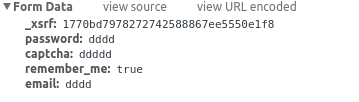

#Scrapy练习

练习目的：模拟登录[知乎](!https://www.zhihu.com)

##表单 
            
 
 
- email,password：知乎账号和密码
- _xsrf:可以从页面之间提取
    - `_xsrf = response.xpath('//input[@name="_xsrf"]/@value').extract()[0]`
- remember_me: 是否记住密码
- captcha: 验证码
    - 链接为[http://www.zhihu.com/captcha.gif?r=1461148436470&type=login](!http://www.zhihu.com/captcha.gif?r=1461148436470&type=login)
    - 知乎此处的r参数为一个13位的unix时间戳`r= str(int(1000 * time.time()))[0:13]`
- notice：`_xsrf`、`captcha`从`https://www.zhihu.com`获得，表单发送到`https://www.zhihu.com/login/email`。故不能直接使用[Using FormRequest.from_response() to simulate a user login](!http://doc.scrapy.org/en/1.0/topics/request-response.html#using-formrequest-from-response-to-simulate-a-user-login)

##cookie

为了能使用同一个状态持续的爬取网站, 就需要保存`cookie`, 使用`cookie`保存状态, Scrapy提供了cookie处理的中间件[CookiesMiddleware](!http://doc.scrapy.org/en/0.24/topics/downloader-middleware.html?highlight=cookie#module-scrapy.contrib.downloadermiddleware.cookies), 可以直接拿来使用.

    scrapy.Request(
        url = 'https://www.zhihu.com',
        meta = {'cookiejar' : 1},
        headers = self.headers,
        callback = self.request_captcha
    )
    
    scrapy.Request(
        url = captcha_url,
        headers = self.headers,
        meta = {
            'cookiejar' : response.meta['cookiejar'],
            '_xsrf' : _xsrf
        },
        callback = self.download_captcha
    )